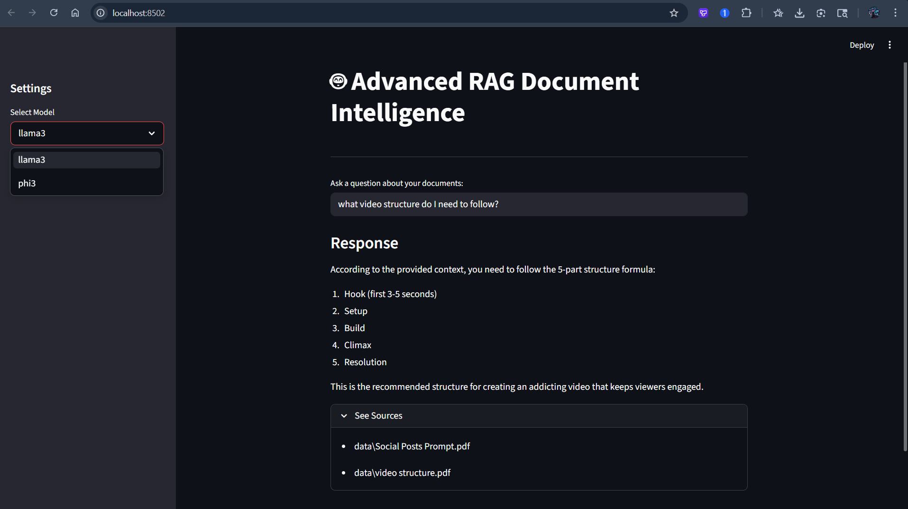
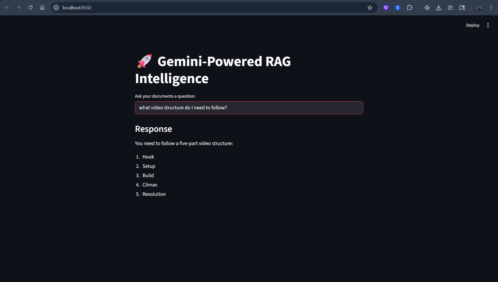

# 🤖 Advanced RAG Document Intelligence

A full-stack Retrieval-Augmented Generation (RAG) application featuring an interactive web UI. This system allows users to chat with their documents (PDFs, Markdown) using a flexible architecture: run completely locally for 100% data privacy, or connect to cloud APIs for lightning-fast performance.

---

## 📸 System Capabilities & Trade-offs

This project is designed to highlight the engineering trade-offs between local inference and cloud processing.

### 1. 🔐 Privacy-First Local Execution (Ollama)

Runs entirely on your machine. Zero API costs and no data leaves your hardware, making it ideal for highly sensitive corporate or personal documents.


*(Demonstrating local inference using open-source models)*

---

### 2. ⚡ High-Speed Cloud Execution (Google Gemini)

Leverages the Gemini API for significantly faster processing times, handling complex queries and larger contexts with near-instant response rates.


*(Demonstrating cloud-accelerated inference for rapid insights)*

---

## 🚀 Key Features

* 🎯 **Interactive Web UI:** Built with Streamlit for rapid prototyping and seamless user experience.
* 🔄 **Hybrid LLM Support:** Dynamically switch between:

  * **Local Models:** Llama 3, Phi-3 via Ollama
  * **Cloud Models:** Gemini API
* 🧠 **Advanced Chunking:**
  Implemented `RecursiveCharacterTextSplitter` with:

  * Chunk Size: **800 characters**
  * Overlap: **150 characters**
  * Ensures semantic continuity across paragraphs.
* 📌 **Source Citation:**
  Automatically retrieves and displays document metadata to reduce hallucination and improve reliability.

---

## 🛠️ Tech Stack

| Layer           | Technology                   |
| --------------- | ---------------------------- |
| Frontend UI     | Streamlit                    |
| Orchestration   | LangChain (Core & Community) |
| Local LLMs      | Ollama (Llama 3, Phi-3)      |
| Cloud LLMs      | Google Gemini API            |
| Embeddings      | Nomic-Embed-Text             |
| Vector Database | ChromaDB                     |

---

## 📂 Project Structure

```text
local-rag-app/
├── assets/                     # Documentation screenshots
│   ├── ollama-local.png
│   └── gemini-cloud.png
├── data/                       # Source PDF/Markdown files
├── chroma/                     # Vector DB (ignored in git)
├── app.py                      # Streamlit web app
├── get_embedding_function.py   # Embedding configuration
├── populate_database.py        # Document ingestion & chunking
├── requirements.txt            # Dependencies
├── .env                        # API keys (ignored in git)
└── README.md                   # Documentation
```

---

## 📦 Installation & Setup

### 1️⃣ Install Local Dependencies

Download and install Ollama from: [https://ollama.com](https://ollama.com)

```bash
ollama pull llama3
ollama pull phi3
ollama pull nomic-embed-text
```

---

### 2️⃣ Setup Python Environment

```bash
python -m venv .venv

# Activate (Windows)
.\\.venv\\Scripts\\activate

# Activate (macOS/Linux)
source .venv/bin/activate

pip install -r requirements.txt
```

---

### 3️⃣ Configure API Keys (Optional for Cloud Mode)

Create a `.env` file in the root directory:

```env
GEMINI_API_KEY="your_api_key_here"
```

---

### 4️⃣ Ingest Data

Place your PDFs/Markdown files inside the `data/` folder and run:

```bash
python populate_database.py
```

---

### 5️⃣ Launch the App

```bash
streamlit run app.py
```

---

## ⚙️ Engineering Decisions

### 🔗 Semantic Overlap

A **150-character overlap** ensures:

* Sentences are not cut mid-way
* Context is preserved across chunks
* Better answer accuracy from LLM

---

### 💾 Database Persistence

ChromaDB is configured for **local persistence**, meaning:

* No need to re-embed documents on restart
* Saves compute and time

---

### 🔀 Hybrid Architecture

Supporting both **Ollama (local)** and **Gemini (cloud)** provides:

* Flexibility (privacy vs performance)
* Scalability without redesigning pipelines
* Production-ready modularity

---

## 🧠 Use Cases

* 📄 Chat with PDFs (research papers, reports)
* 🏢 Enterprise document intelligence
* 🔒 Privacy-sensitive document analysis
* ⚡ Fast cloud-powered insights
* 🧑‍💻 Developer experimentation with RAG pipelines

---

## 📌 Future Improvements

* Multi-user authentication
* Document versioning
* UI enhancements (chat history, themes)
* Support for more vector databases (FAISS, Pinecone)
* Advanced reranking techniques

---

## 🤝 Contributing

Contributions are welcome! Feel free to fork the repo and submit a pull request.

---

## 📜 License

This project is licensed under the [MIT License](LICENSE).

---

## ⭐ Support

If you found this project useful, consider giving it a ⭐ on GitHub!
